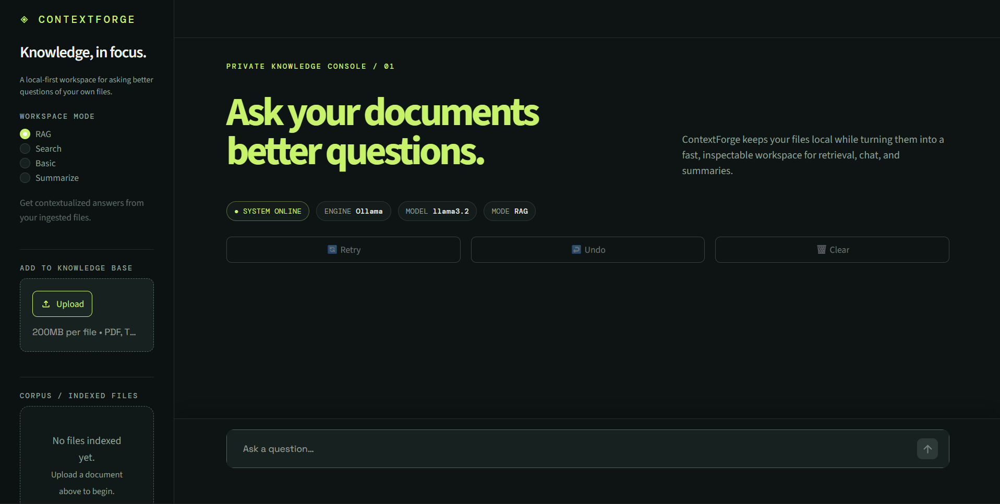
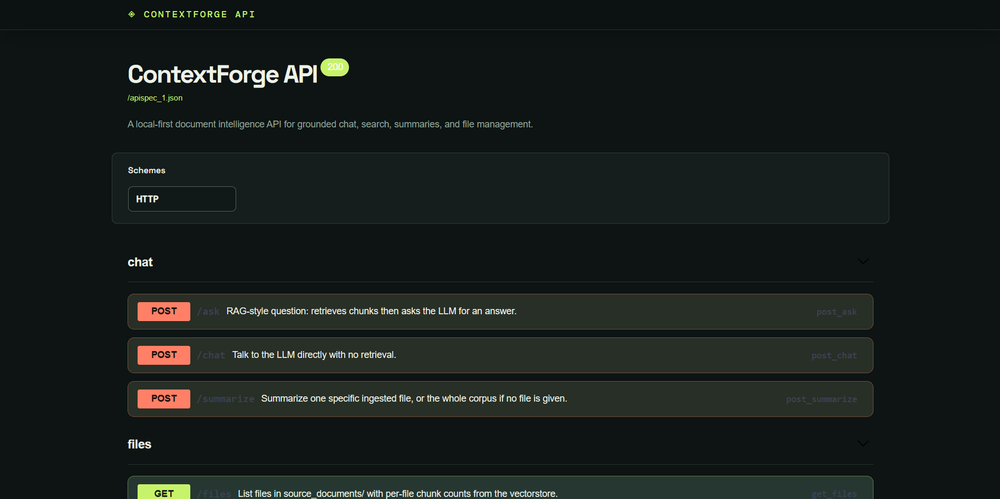
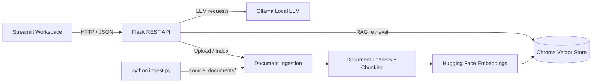

# ContextForge

> A private, local-first document intelligence workspace built with Flask, Streamlit, Chroma, and Ollama.

<p align="center">
  
</p>

<p align="center">
  <strong>Ask private documents better questions.</strong><br>
  Grounded answers, searchable sources, summaries, and file management in one local application.
</p>

---

## Overview

ContextForge is an end-to-end retrieval-augmented generation (RAG) application for working with personal documents.

It combines:

- Flask REST API
- Streamlit web workspace
- Document ingestion and chunking
- Hugging Face embeddings
- Chroma vector storage
- Local Ollama inference
- Interactive Swagger API documentation
- Automated API tests
- Docker support

The application follows a local-first approach where documents, embeddings, vector storage, and LLM inference can run on the user's machine.

For RAG queries, ContextForge retrieves relevant document chunks and provides them to the local language model as context. Retrieved source chunks are returned with the response so users can inspect the information used to generate the answer.

## Features

- **RAG Chat** — Ask questions using indexed document context and receive supporting source chunks.
- **Search Mode** — Retrieve and inspect relevant document chunks without LLM-generated synthesis.
- **Direct Chat** — Interact directly with the configured Ollama model without retrieval.
- **Summarization** — Summarize an indexed file or the available document corpus.
- **Document Management** — Upload, list, inspect chunk counts, and delete indexed documents.
- **Multiple File Formats** — Supports PDF, Word, PowerPoint, Markdown, HTML, CSV, email, EPUB, ODT, and text-based documents through the configured loaders.
- **Interactive API Documentation** — Explore and test REST endpoints through Swagger UI at `/apidocs`.
- **Local Embeddings** — Uses Hugging Face sentence-transformer embeddings.
- **Local Vector Search** — Uses Chroma for persistent vector storage.
- **Local LLM Inference** — Uses Ollama for local model execution.
- **Security Controls** — Includes upload validation, safe filenames, optional bearer authentication, CORS configuration, rate limiting, and controlled API errors.
- **Docker Support** — Provides a container workflow for running the application stack.

## Screenshots

### Streamlit Workspace

<p align="center">
  
</p>

### API Console

<p align="center">
  
</p>

## Architecture



### RAG Pipeline

```text
Document
   │
   ▼
Document Loader
   │
   ▼
Text Extraction
   │
   ▼
Chunking
   │
   ▼
Hugging Face Embeddings
   │
   ▼
Chroma Vector Store
   │
   ▼
Similarity Retrieval
   │
   ▼
Relevant Document Chunks
   │
   ▼
Ollama / Local LLM
   │
   ▼
Answer + Source Chunks
```

## Technology Stack

| Layer | Technology |
|---|---|
| API | Flask |
| API Documentation | Flasgger / OpenAPI |
| CORS | Flask-CORS |
| Rate Limiting | Flask-Limiter |
| Retrieval | LangChain |
| Vector Database | Chroma |
| Embeddings | Hugging Face Sentence Transformers |
| LLM Inference | Ollama |
| Frontend | Streamlit |
| Document Processing | PyMuPDF, Unstructured and format-specific loaders |
| Testing | Pytest |
| Containerization | Docker |
| Configuration | Environment variables |

## Requirements

For local development:

- Python 3.11 or newer
- Ollama
- Git
- Windows PowerShell, macOS Terminal, or Linux shell

Docker is optional.

Git is used to version the project and publish it to GitHub. It is not needed
to run the application from an existing folder.

The default LLM is `llama3.2`.

The default embedding model is `all-MiniLM-L6-v2`.

> Model performance and hardware requirements depend on the selected Ollama model and available system resources.

# Quick Start

## Windows PowerShell

Run the following commands from the repository root.

### 1. Create the Python environment

```powershell
if (-not (Test-Path .\venv\Scripts\python.exe)) {
    py -3 -m venv venv
}
```

Activate it if desired:

```powershell
.\venv\Scripts\Activate.ps1
```

Upgrade pip:

```powershell
.\venv\Scripts\python.exe -m pip install --upgrade pip
```

Install dependencies:

```powershell
.\venv\Scripts\python.exe -m pip install -r requirements.txt
```

### 2. Install and start Ollama

```powershell
ollama --version
ollama pull llama3.2
ollama list
```

### 3. Add documents

Place supported documents inside `source_documents/`, then run:

```powershell
.\venv\Scripts\python.exe ingest.py
```

The ingestion process loads documents, splits them into chunks, generates embeddings, and stores vectors in `db/`.

### 4. Start the Flask API

```powershell
.\venv\Scripts\python.exe api.py
```

The API runs by default on:

```text
http://127.0.0.1:5001
```

### 5. Start Streamlit

Open a second PowerShell terminal:

```powershell
.\venv\Scripts\python.exe -m streamlit run ui\streamlit_app.py
```

The workspace will normally be available at:

```text
http://localhost:8501
```

## Application URLs

| Service | URL |
|---|---|
| ContextForge Workspace | http://localhost:8501 |
| Flask API | http://127.0.0.1:5001 |
| Swagger UI | http://127.0.0.1:5001/apidocs |
| OpenAPI JSON | http://127.0.0.1:5001/apispec_1.json |

# API Reference

| Method | Endpoint | Description |
|---|---|---|
| `GET` | `/health` | Return API status and configured model |
| `POST` | `/ask` | Retrieve document context and generate an answer |
| `POST` | `/chat` | Generate a response without document retrieval |
| `POST` | `/summarize` | Summarize one file or the document corpus |
| `GET` | `/files` | List indexed files and chunk counts |
| `POST` | `/ingest` | Upload and index a document |
| `DELETE` | `/files/<name>` | Remove a document and its vector entries |

The interactive Swagger console provides request schemas and a **Try it out** workflow.

## Example API Request

```powershell
Invoke-RestMethod `
  -Uri "http://127.0.0.1:5001/ask" `
  -Method Post `
  -ContentType "application/json" `
  -Body '{"query":"What is this document about?"}'
```

# Configuration

Create a `.env` file from the provided example:

```powershell
Copy-Item .env.example .env
```

| Variable | Default | Description |
|---|---|---|
| `MODEL` | `llama3.2` | Ollama model used for generation |
| `EMBEDDINGS_MODEL_NAME` | `all-MiniLM-L6-v2` | Hugging Face embedding model |
| `PERSIST_DIRECTORY` | `db` | Chroma persistence directory |
| `SOURCE_DIRECTORY` | `source_documents` | Document source directory |
| `TARGET_SOURCE_CHUNKS` | `4` | Number of chunks retrieved for RAG |
| `PORT` | `5001` | Flask API port |
| `BIND_HOST` | `127.0.0.1` | Flask API bind address |
| `API_URL` | `http://localhost:5001` | API URL used by Streamlit |
| `API_KEY` | unset | Optional bearer-token authentication |
| `MAX_UPLOAD_MB` | `50` | Maximum upload size |
| `MAX_QUERY_LENGTH` | `10000` | Maximum query length |
| `CORS_ORIGINS` | `*` | Comma-separated allowed origins |

Streamlit configuration is stored in `.streamlit/config.toml`.

# Testing

Run the automated tests with:

```powershell
.\venv\Scripts\python.exe -m pytest -q
```

For manual API, upload, deletion, UI, and Docker verification, see `MANUAL_TESTING.md`.

# Docker

Build the image:

```powershell
docker build -t contextforge .
```

Run the container:

```powershell
docker run --rm `
  -p 5001:5001 `
  -p 8501:8501 `
  -p 11434:11434 `
  -v "${PWD}\source_documents:/app/source_documents" `
  -v "${PWD}\db:/app/db" `
  contextforge
```

Running Ollama inside Docker requires sufficient system resources for the selected model.

# Project Structure

```text
ContextForge/
├── .streamlit/
│   └── config.toml
├── tests/
├── ui/
│   └── streamlit_app.py
├── docs/
│   └── images/
├── source_documents/
├── db/
├── logs/
├── api.py
├── ingest.py
├── constants.py
├── Dockerfile
├── docker-entrypoint.sh
├── .dockerignore
├── .env.example
├── .gitignore
├── LICENSE
├── requirements.txt
├── MANUAL_TESTING.md
├── Makefile
├── pull-model.sh
└── README.md
```

Runtime-generated directories such as `db/`, `logs/`, and local uploaded documents should not be committed to the public repository.

# Security

ContextForge includes:

- Filename sanitization
- Upload validation
- Configurable upload size limits
- Query length limits
- Optional bearer-token authentication
- Configurable CORS origins
- Rate limiting
- Controlled API error responses
- Environment-based configuration

Never commit `.env`, API keys, access tokens, private documents, or credentials.

# Local-First Design

The default architecture keeps the following components on the local machine:

```text
Documents
    ↓
Document Processing
    ↓
Local Embeddings
    ↓
Chroma
    ↓
Local Ollama Model
```

This makes the project suitable for experimenting with private documents without requiring a hosted LLM API for the default workflow.

# Development Workflow

```text
1. Add documents
       ↓
2. Run ingestion
       ↓
3. Start Flask API
       ↓
4. Start Streamlit
       ↓
5. Ask questions
       ↓
6. Inspect retrieved sources
       ↓
7. Run automated tests
       ↓
8. Review changes
       ↓
9. Commit
```

# Project Status

ContextForge is a personal portfolio project focused on:

- Applied AI
- Retrieval-Augmented Generation
- Backend engineering
- REST API development
- Local LLM inference
- Vector search
- Document processing
- Automated testing
- Docker/containerization
- User-facing product design

The project is maintained as a learning and engineering showcase.

## License

This project is not open source. The repository and its assets are provided
for portfolio and evaluation purposes only. See [LICENSE](LICENSE) for the
usage restrictions.

## Author

**Sarthak Wadhwa**

GitHub: [sarthakwadhwa2005](https://github.com/sarthakwadhwa2005)

